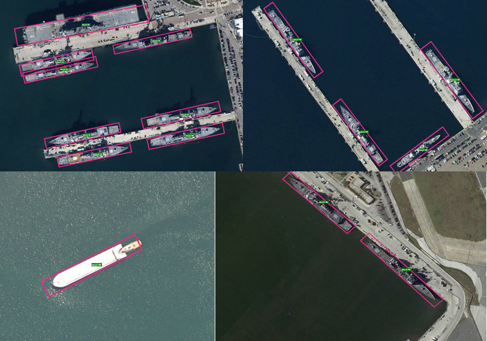
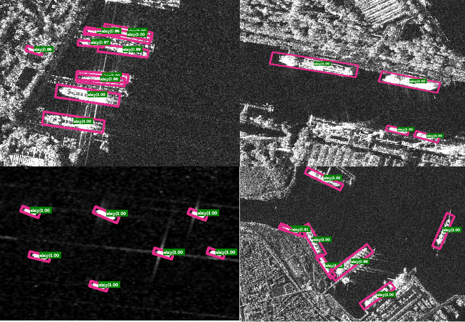

## :rocket:RetinaNet Oriented Detector Based PyTorch  
This is an oriented detector **Rotation-RetinaNet** implementation on Optical and SAR **ship dataset**.  
- SAR ship dataset (SSDD): [SSDD Dataset link](https://github.com/TianwenZhang0825/Official-SSDD)  
- Optical ship dataset (HRSC): [HRSC Dataset link](https://www.kaggle.com/guofeng/hrsc2016)  
- RetinaNet Detector original paper link is [here](https://openaccess.thecvf.com/content_ICCV_2017/papers/Lin_Focal_Loss_for_ICCV_2017_paper.pdf).  
## :star2:Performance of the implemented Rotation-RetinaNet Detector

### Detection Performance on HRSC Dataset.


### Detection Performance on SSDD Dataset.


## :dart:Experiment

| Dataset | Backbone | Input Size | bs | Trick | mAP.5 | Config |
|:-------:|:--------:|:----------:|:--:|:-----:|:-----:|:------:|
|  SSDD   | ResNet-50| 512 x 512  | 16 | N     | 78.96 |[config file](/configs/retinanet_r50_fpn_ssdd.yml)|
|  SSDD   | ResNet-50| 512 x 512  | 16 |Augment| 85.6  |[config file](/configs/retinanet_r50_fpn_ssdd.yml)|
|  HRSC   | ResNet-50| 512 x 512  | 16 | N     | 70.71 |[config file](/configs/retinanet_r50_fpn_hrsc.yml)|
|  HRSC   | ResNet-50| 512 x 512  | 4  | N     | 74.22 |[config file](/configs/retinanet_r50_fpn_hrsc.yml)|
|  HRSC   | ResNet-50| 512 x 512  | 16 |Augment| 80.20 |[config file](/configs/retinanet_r50_fpn_hrsc.yml)|

## :boom:Get Started
### Installation
#### A. Install requirements:
```
conda create -n rotate python=3.7
conda activate rotate
conda install pytorch==1.7.0 torchvision==0.8.0 torchaudio==0.7.0 cudatoolkit=11.0 -c pytorch
pip install -r requirements.txt

Note: the opencv version must > 4.5.1
```
#### B. Install rotation\_nms and rotation\_overlaps module:
```
Only need one Step:
make
```
## Demo
### A. Set project's data path
you should set project's data path in `yml` file first.
```
# .yml file
# Note: all the path should be absolute path.
data_path = r'/$ROOT_PATH/SSDD_data/'  # absolute data root path
output_path = r'/$ROOT_PATH/Output/'  # absolute model output path

# For example
$ROOT_PATH
    -HRSC/
        -train/  # train set
	   -Annotations/
	      -*.xml
	   -images/
	      -*.jpg
	-test/  # test set
	   -Annotations/
	      -*.xml
           -images/
	      -*.jpg
	-ground-truth/
	   -*.txt  # gt label in txt format (for voc evaluation method)

    -SSDD/
       -train/  # train set
	  -Annotations/
	     -*.xml
	  -images/
	     -*.jpg
       -test/  # test set
	  -Annotations/
	     -*.xml
          -images/
	     -*.jpg
       -ground-truth/
	  -*.txt  # gt label in txt format (for voc evaluation method)
	  

    -Output/
        -checkpoints/
	    - the path of saving chkpt files
	-tensorboard/
	   - the path of saving tensorboard event files
	-evaluate/
	    - the path of saving model detection results for evaluate (voc method method)
	-log.log (save the loss and eval result)
	-yml file (config file)
```
### B. Run the show.py
```
# for SSDD dataset
python show.py --config_file ./configs/retinanet_r50_fpn_ssdd.yml --chkpt {chkpt.file} --result_path show_result/RSSDD --pic_name demo1.jpg

# for HRSC dataset
python show.py --config_file ./configs/retinanet_r50_fpn_hrsc.yml --chkpt {chkpt.file} --result_path show_result/HRSC --pic_name demo1.jpg
```
## Train
### A. Prepare dataset
you should structure your dataset files as shown above.
### B. Manual set project's hyper parameters
you should manual set projcet's hyper parameters in `config` file.
```
1. data file structure (Must Be Set !)
   has shown above.

2. Other settings (Optional)
   if you want to follow my experiment, dont't change anything.
```
### C. Train Rotation-RetinaNet on SSDD or HRSC dataset with resnet-50 from scratch
#### C.1 Download the pre-trained resnet-50 pth file
you should download the pre-trained resnet-50 pth first and put the pth file in `resnet_pretrained_pth/` folder.
#### C.2 Train Rotation-RetinaNet Detector on SSDD or HRSC Dataset with pre-trained pth file
```
# train model on SSDD dataset from scratch
python train.py --config_file ./configs/retinanet_r50_fpn_ssdd.yml --resume None

# train model on HRSC dataset from scratch
python train.py --config_file ./configs/retinanet_r50_hrsc.yml --resume None

```
### D. Resume training Rotation-RetinaNet detector on SSDD or HRSC dataset
```
# train model on SSDD dataset from specific epoch
python train.py --config_file ./configs/retinanet_r50_fpn_ssdd.yml --resume {epoch}_{step}.pth

# train model on HRSC dataset from specific epoch
python train.py --config_file ./configs/retinanet_r50_hrsc.yml --resume {epoch}_{step}.pth

```
## Evaluation
### A. evaluate model performance on SSDD or HRSC val set.
```
python eval.py --Dataset SSDD --config_file ./configs/retinanet_r50_fpn_ssdd.yml --evaluate True --chkpt {epoch}_{step}.pth
python eval.py --Dataset HRSC --config_file ./configs/retinanet_r50_fpn_hrsc.yml --evaluate True --chkpt {epoch}_{step}.pth
```
## :bulb:Inferences
Thanks for these great work.  
[https://github.com/open-mmlab/mmrotate](https://github.com/open-mmlab/mmrotate)  
[https://github.com/ming71/Rotated-RetinaNet](https://github.com/ming71/Rotated-RetinaNet)

## :fast\_forward:Zhihu Link
[zhihu article](https://zhuanlan.zhihu.com/p/490422549?)
